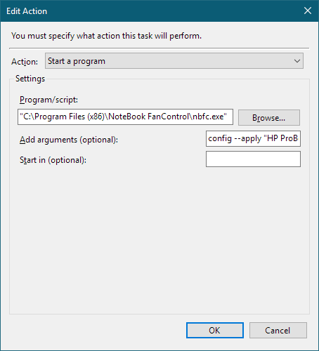

# Power Event Provider

Power Event Provider is a Windows service which posts power events such as power scheme changes, battery status changes, display state changes, etc. into the Windows event log.
Besides for monitoring purposes, these events can also be used as triggers for the Windows task scheduler. This makes it possible to run any application or script when a power event occurs.

## Available events

Power Event Provider supports 5 groups of events. Not all events are supported on each and every system.

### Power schemes

Event                                                  | ID
-------------------------------------------------------|---------
Power scheme personality changed: **Power saver**      | 1000
Power scheme personality changed: **Automatic**        | 1001
Power scheme personality changed: **High performance** | 1002

### Power line status

Event                                                  | ID
-------------------------------------------------------|---------
Power line status changed: **AC power source**         | 2000
Power line status changed: **Battery**                 | 2001
Power line status changed: **UPS power source**        | 2002
Power line status changed: **Out of range**            | 2003

### Notebook lid state

Event                                                  | ID
-------------------------------------------------------|---------
Notebook lid state changed: **Closed**                 | 3000
Notebook lid state changed: **Open**                   | 3001

### Battery percentage

Event                                                  | ID
-------------------------------------------------------|---------
Remaining battery percentage changed: **1%**         | 4*001*
Remaining battery percentage changed: **2%**         | 4*002*
...|...
Remaining battery percentage changed: **99%**         | 4*099*
Remaining battery percentage changed: **100%**         | 4*100*

:bulb: Battery percentage events are disabled by default to avoid spamming the event log.

### Display state

Event                                                  | ID
-------------------------------------------------------|---------
Display state changed: **Off**                         | 5000
Display state changed: **On**                          | 5001
Display state changed: **Dimmed**                      | 5002

## Download

You can download the PowerEventProvider setup from github: [link (github)](https://github.com/hirschmann/powereventprovider/releases)

## Configuration

You can enable/disable monitoring of event groups by editing the *PowerEventProvider.exe.config* file in the PowerEventProvider installation directory.
Just set event groups which should show in the event log to **True**.

After changing the config file, the *PowerEventProvider* service must be restarted (e.g. via Windows task manager or *services.msc*) in order for the changes to take effect.

The default configuration looks like this:

```xml
<?xml version="1.0"?>
<configuration>
    <configSections>
        <sectionGroup name="applicationSettings" type="System.Configuration.ApplicationSettingsGroup, System, Version=4.0.0.0, Culture=neutral, PublicKeyToken=b77a5c561934e089" >
            <section name="PowerEventProviderService.Properties.Settings" type="System.Configuration.ClientSettingsSection, System, Version=4.0.0.0, Culture=neutral, PublicKeyToken=b77a5c561934e089" requirePermission="false" />
        </sectionGroup>
    </configSections>
    <startup>
        <supportedRuntime version="v4.0" sku=".NETFramework,Version=v4.0,Profile=Client"/>
    </startup>
    <applicationSettings>
        <PowerEventProviderService.Properties.Settings>
            <setting name="MonitorBatteryPercentage" serializeAs="String">
                <value>False</value>
            </setting>
            <setting name="MonitorDisplayState" serializeAs="String">
                <value>True</value>
            </setting>
            <setting name="MonitorLidswitchState" serializeAs="String">
                <value>True</value>
            </setting>
            <setting name="MonitorPowerSchemePersonality" serializeAs="String">
                <value>True</value>
            </setting>
            <setting name="MonitorPowerSource" serializeAs="String">
                <value>True</value>
            </setting>
        </PowerEventProviderService.Properties.Settings>
    </applicationSettings>
</configuration>
```

## Viewing power events in the event log

### Powershell

You can list all PowerEventProvider event log entries by entering the following line in powershell:

```powershell
get-eventlog -logname Application -source PowerEventProvider
```

### Event Viewer

If you prefer GUI over command line, you can create a custom view for PowerEventProvider related events in the Windows Event Viewer.

Open the Windows event log (*eventvwr.msc*) and create a custom view:


Select a log (*Application*) and a source (*PowerEventProvider*) to view:


Open your custom view:


## Using events as scheduled task triggers

Since PowerEventProvider was created as a companion application for [NoteBook FanControl (NBFC)](https://github.com/hirschmann/nbfc), this example shows how to switch NBFC profiles when a notebook's power source changes.

Open the Windows task scheduler (*taskschd.msc*):


Give the task a name and select the user account which should be used to run the task:


Create a new trigger and select "Begin the task: On an event". Then select a log (*Application*) and a event source (*PowerEventProvider*).
To run the task as soon as the notebook's power source switches to "battery", set the *Event ID* to *2001*:


Create a new action and select "Start a program". Then put in the path to the NBFC command line interface as program to run: `"C:\Program Files (x86)\NoteBook FanControl\nbfc.exe"`  

Finally, set `config --apply "<some config name>"` as arguments. In this case I wanted the fan to be more silent when the notebook is not in it's docking station, so the argument was `config --apply "HP ProBook 6465b silent"`.



At last - in this case - it's important to untick all conditions, because the task should run immediately when the power source changes without any delays.


The task settings can be left at default values:


After completing these steps, you can test if everything is working properly by unplugging your notebook. NBFC should switch to the profile you have defined in the task.

To make NBFC switch back to the default profile when you plug in your notebook, just create a second task which is triggered by event ID 2000 (instead of 2001) and sets the default configuration for your notebook (in my case: `config --apply "HP ProBook 6465b"`).
